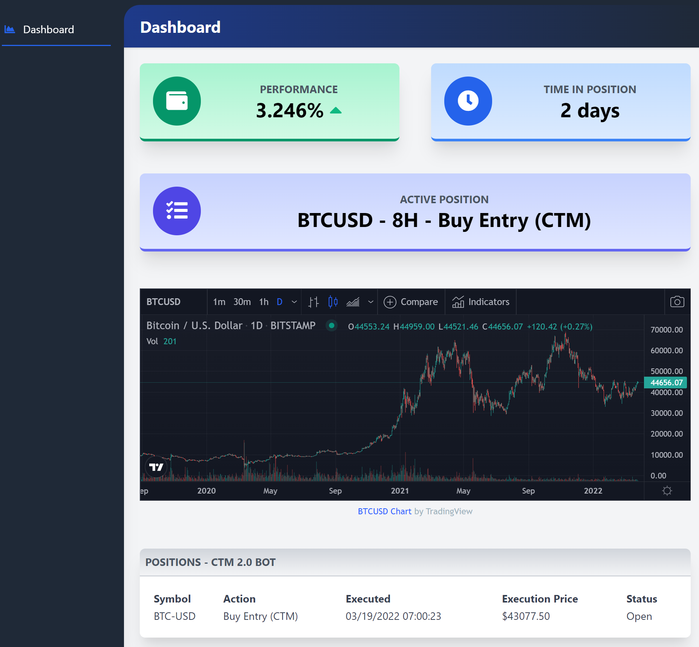

# Tradingview Webhook Crypto Bot

trading-view-webhook-crypto-bot is a trading pot that allows users to place trades using Tradingview's webhook alerts. 
There is also a simple dashboard to help you monitor your recent trades.



## Quickstart Using Python

This process assumes you have Python (3) installed.

```
pip install virtualenv # if you don't already have virtualenv installed
python -m virtualenv env
source env/Scripts/active # your activate may be in a slightly different location
pip install -r requirements.txt
```

After installing the pre-requisites, start the app on default port `localhost:500`

```
python app.py
```

After the app starts, navigate to the URL identified by your console.
